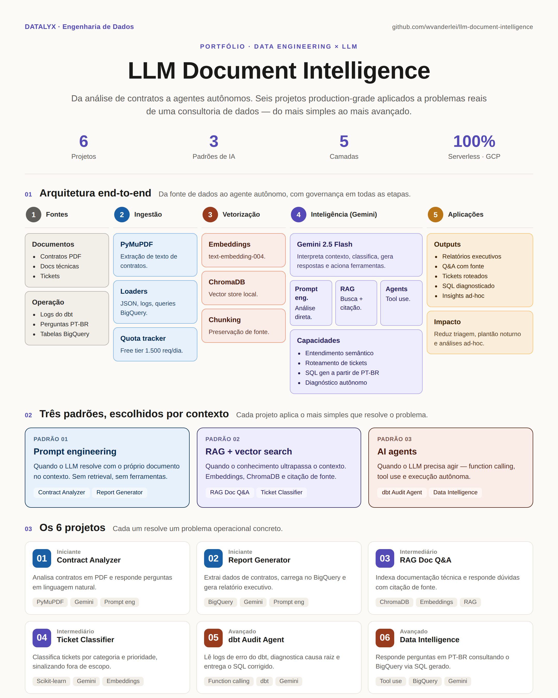

# LLM Document Intelligence


Portfolio de projetos de LLM e IA aplicados a problemas reais de uma consultoria de dados. A progressao vai desde analise de contratos com prompt engineering ate agentes autonomos que diagnosticam falhas em pipelines e respondem perguntas de negocio diretamente do BigQuery.

---

## Contexto de negocio

Os projetos usam como base a **Datalyx**, uma consultoria especializada em engenharia de dados com tres modelos de contrato (Radar, Forja, Nexus). Cada cliente tem contratos ativos, abre tickets de suporte e depende de pipelines que precisam de monitoramento.

Esse cenario foi escolhido por refletir situacoes que qualquer empresa de dados enfrenta: volume crescente de contratos, equipe sobrecarregada com suporte, pipelines quebrando fora do horario, gestores pedindo analises em cima da hora.

---

## Arquitetura



---

## Os 6 projetos

| # | Projeto | O que resolve | Fase |
|---|---------|---------------|------|
| 1 | [Contract Analyzer](api-prompt-engineering/contract-analyzer/) | Analisa um contrato em PDF e responde perguntas em linguagem natural | Iniciante |
| 2 | [Report Generator](api-prompt-engineering/report-generator/) | Extrai dados dos contratos, carrega no BigQuery e gera relatorio executivo automaticamente | Iniciante |
| 3 | [RAG: Document Q&A](rag-vector-search/rag-docs/) | Indexa a documentacao tecnica entregue aos clientes e responde duvidas com citacao de fonte | Intermediario |
| 4 | [Ticket Classifier](rag-vector-search/ticket-classifier/) | Classifica tickets de suporte por categoria e prioridade, sinalizando o que esta fora do escopo do contrato | Intermediario |
| 5 | [dbt Audit Agent](ai-agents/dbt-audit-agent/) | Agente autonomo que le logs de erro do dbt, diagnostica a causa raiz e entrega o SQL corrigido | Avancado |
| 6 | [Data Intelligence Assistant](ai-agents/data-intelligence/) | Responde perguntas de negocio em portugues consultando os dados do BigQuery com SQL gerado por LLM | Avancado |

---

## Como as fases se conectam

```
Fase 1: antes e depois do projeto
  O LLM le contratos, extrai dados e gera relatorios.
  Resolve: tempo gasto com documentacao manual.

Fase 2: durante a operacao
  O RAG responde duvidas dos clientes sobre o que foi entregue.
  O classificador roteia e prioriza tickets automaticamente.
  Resolve: triagem manual de suporte e perguntas repetitivas.

Fase 3: monitoramento continuo
  O agente detecta e diagnostica falhas em pipelines sem intervencao humana.
  O assistente responde qualquer pergunta de negocio consultando os dados.
  Resolve: plantao noturno para pipelines e analises ad-hoc para gestao.
```

---

## Stack

| Categoria | Tecnologias |
|-----------|-------------|
| LLM | Google Gemini API (`gemini-2.5-flash`) |
| Embeddings | `text-embedding-004` via Google AI Studio |
| Cloud | Google Cloud Platform, BigQuery |
| Vector Store | ChromaDB (local) |
| ML | Scikit-learn, Pandas, joblib |
| PDF | PyMuPDF |
| Agents | Function calling nativo do Gemini |
| Linguagem | Python 3.11+ |

---

## Pre-requisitos

- Python 3.11+
- [Google AI Studio API Key](https://aistudio.google.com) (free tier, 1.500 req/dia)
- Google Cloud SDK com `application-default login` (necessario apenas nos projetos com BigQuery: 2, 3 e 6)
- Projeto GCP com BigQuery ativo

---

## Configuracao

### 1. Clone o repositorio

```bash
git clone https://github.com/wvanderlei/llm-document-intelligence.git
cd llm-document-intelligence
```

### 2. Configure as variaveis de ambiente

```bash
cp .env.example .env
```

Preencha o `.env`:

```env
GEMINI_API_KEY=AIza...
GCP_PROJECT_ID=seu-projeto-id
GCP_REGION=us-central1
```

### 3. Autentique no Google Cloud (projetos 2, 3 e 6)

```bash
gcloud auth application-default login
```

---

## Como rodar cada projeto

Cada projeto e independente com seu proprio ambiente virtual:

```bash
cd <caminho-do-projeto>
python -m venv .venv
.venv\Scripts\activate        # Windows
source .venv/bin/activate     # Linux/Mac
pip install -r requirements.txt
python src/<script>.py
```

Consulte o `README.md` de cada projeto para instrucoes especificas.

---

## Quota tracker

Todos os projetos compartilham o arquivo `quota_tracker.py` na raiz. Ele registra cada chamada a API Gemini em um arquivo local (`.quota.json`), exibe o consumo no inicio de cada execucao e bloqueia automaticamente ao atingir o limite diario de 1.500 requisicoes.

---

## Estrutura do repositorio

```
llm-document-intelligence/
│
├── api-prompt-engineering/
│   ├── contract-analyzer/      # Projeto 1
│   └── report-generator/       # Projeto 2
│
├── rag-vector-search/
│   ├── rag-docs/               # Projeto 3
│   └── ticket-classifier/      # Projeto 4
│
├── ai-agents/
│   ├── dbt-audit-agent/        # Projeto 5
│   └── data-intelligence/      # Projeto 6
│
├── quota_tracker.py
├── .env.example
├── .gitignore
└── README.md
```

---

## Autor

**Waydson Barros** — Engenheiro de dados com foco em aplicacoes de LLM e arquiteturas modernas de dados no Google Cloud.
